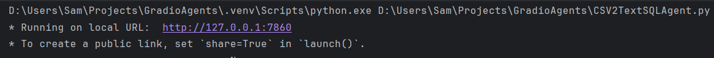
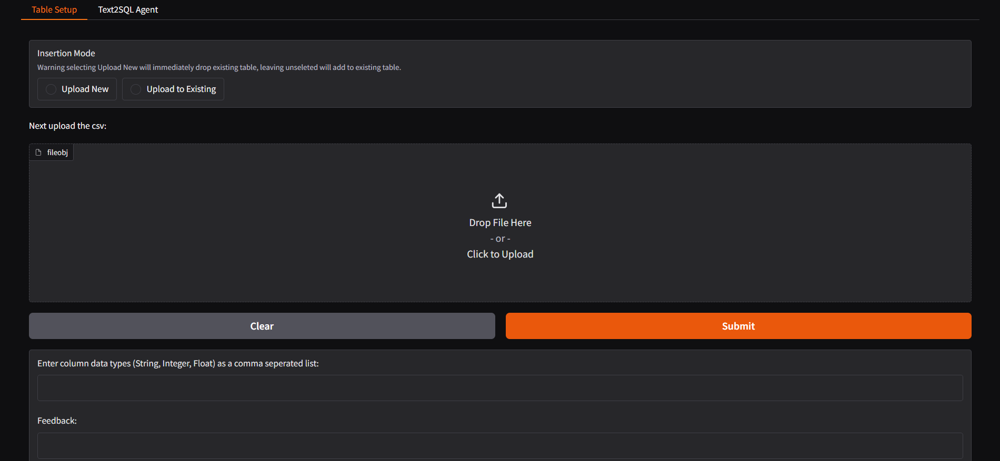

# CSV-2-TextSQLAgent
### [Huggingface Space](https://huggingface.co/spaces/Agents-MCP-Hackathon/CSV-2-SQLAgent)
## Description

A gradio app that allows you to take any excel spreadsheet exported in .csv form and convert it to an SQL table which can then be queried with a Text2SQL code agent built with the smolagents library. 

### Dependencies

* gradio
* SQLAlchemy
* smolagents
  
#### Installing Dependencies
*  Open cmd line in your intended project directory and clone the repo
```
git clone https://github.com/SamKa1u/Gradio-Agents-Hackathon.git
```
*  In the same directory run this cmd
```
pip install -r requirements.txt
```
### Executing Program Locally

*  Run the file then navigate to the local URL for the demo
  

*  The app will be ready to run presuming a valid nebius api key for the agent's inference is set
  
  
### Changing Inference Provider
*  Navigate to agent_setup() in CSV2TextSQLAgent.py
```
def agent_setup():
    """
        Initialize the inference client, as well as the sql agent.
            Args:
                None
            Returns:
                sql_agent (Agent): The agent that will be used for inference.
            """
    sql_model = InferenceClientModel(
        api_key=NEBIUS_API_KEY,           <---------- replace with your API key
        model_id="Qwen/Qwen3-235B-A22B",  <---------- replace with model of choice
        provider="nebius",                <---------- replace with your inference provider
    )
    # define SQL Agent
    sql_agent = CodeAgent(
        tools=[sql_engine],
        model=sql_model,
        max_steps=5,
    )
    return sql_agent
```

## Author

Samuel Kalu
  
* email : [samkalu@ttu.edu](mailto:samkalu@ttu.edu)
* linkedin : [@SamuelKalu](https://www.linkedin.com/in/samuel-kalu-74a359342/)


## Acknowledgments
### This project would not have been possible without the resources provided by:
*  [Agents-MCP-Hackathon](https://huggingface.co/Agents-MCP-Hackathon)
*  [Nebius Ai Studio](https://studio.nebius.com/)
### Inspiration, code snippets, etc.
#### Huggingface:
* [Text-to-SQL example](https://huggingface.co/docs/smolagents/en/examples/text_to_sql)
* [Building Good Smolagents Tutorial](https://smolagents.org/docs/building-good-smolagents/)
* [Docs](https://huggingface.co/docs/smolagents/en/index)
#### Deeplearning.ai:
* [Smolagents Course](https://learn.deeplearning.ai/courses/building-code-agents-with-hugging-face-smolagents/lesson/k0boj/build-a-deep-research-agent)
* [Gradio Gen Ai Course](https://learn.deeplearning.ai/courses/huggingface-gradio/lesson/fd97r/introduction)
#### Gradio:
* [HF Spaces Hosting Guide](https://www.gradio.app/guides/sharing-your-app#hosting-on-hf-spaces)
* [Docs](https://www.gradio.app/docs/gradio/radio#demos)


